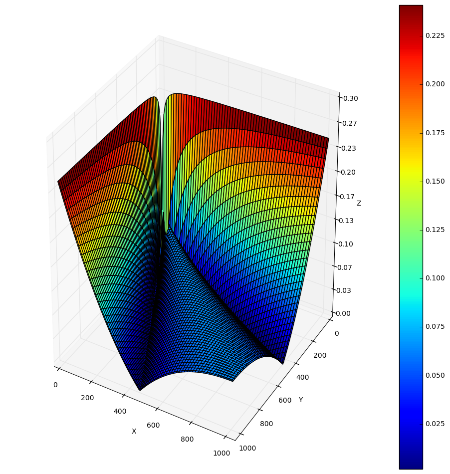

# Norm approximation on restricted quantized domain
Fast approximation of the norm over the value of a 10bit unsigned int 
using batch gradient descent to minimize the squared error

### Open the jupyter notebook to see how it was worked out and the study of the approximation

### Approximation formula:
0.7531854654594905(x+y) approximate (x**2+y**2)**0.5

# Relative Error

